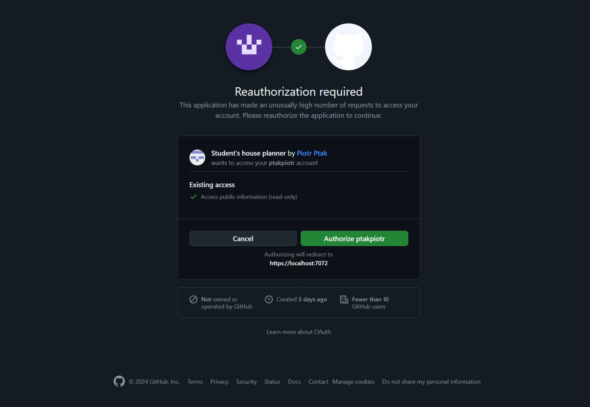
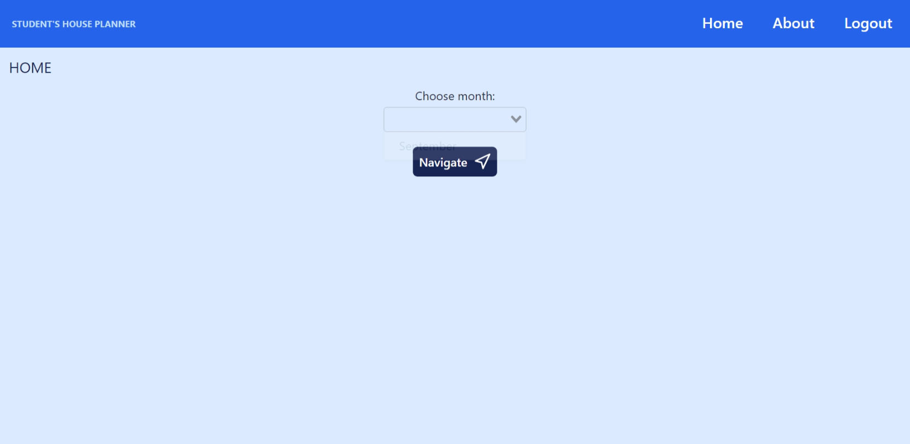
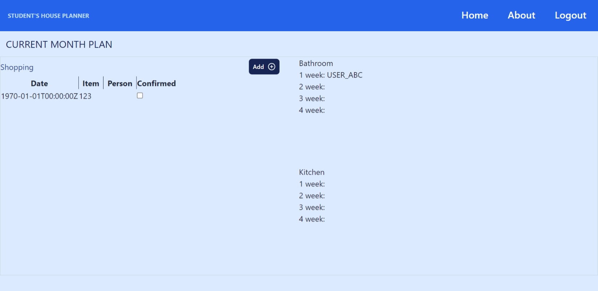
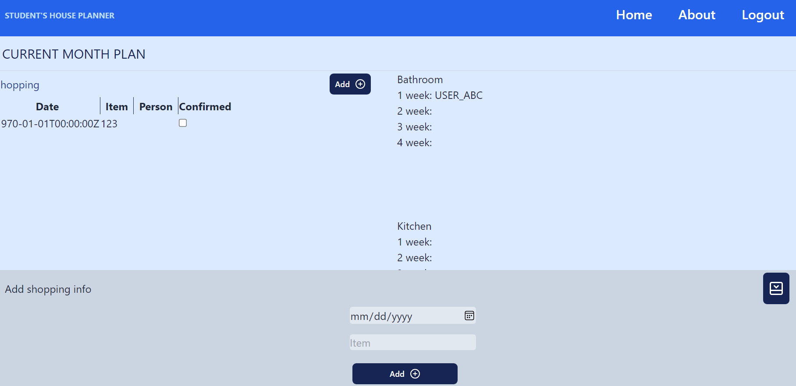

# Students' house planner

## Table of contents

- [General info](#general-info)
- [Technologies](#technologies)
- [Examples](#examples)

## General info

App created with Vue3 and ASP.NET 8 to help manage students' house duties within one room. It offers functionalities for reporting shopping and planning kitchen and bathroom cleaning.

## Technologies

- Vue.js 3
- ASP.NET 8
- YARP
- EF Core 8 (with PostgreSQL)
- Github authentication
- Lucide Vue
- Tailwind CSS

## Examples

